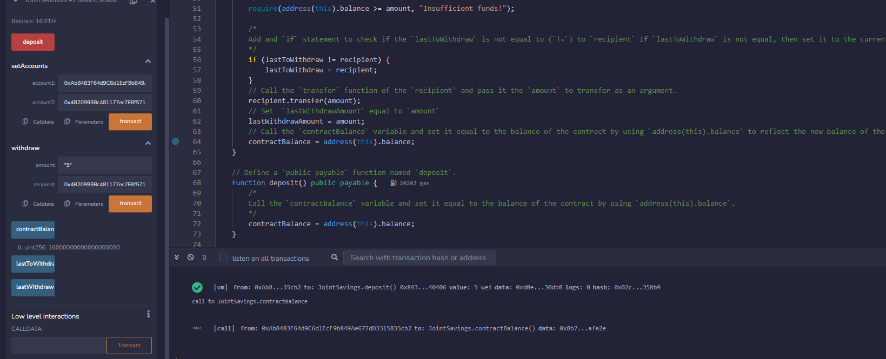
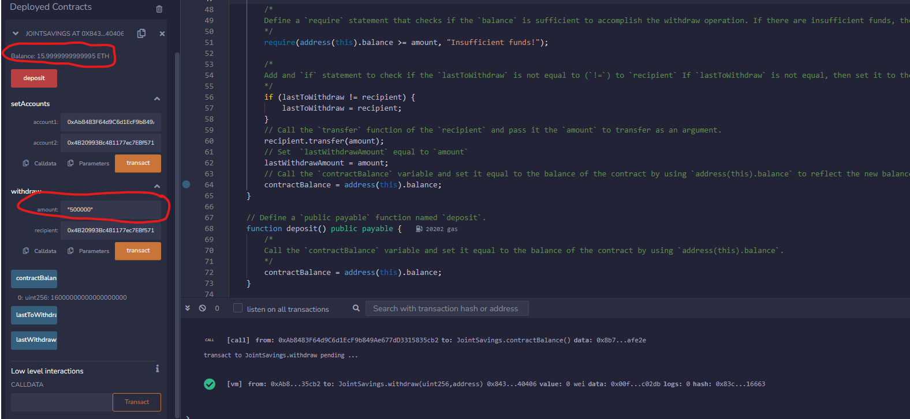

## Background
A fintech startup is disrupting the finance industry with its own cross-border, Ethereum-compatible blockchain that connects financial institutions. Currently, the team is building smart contracts to automate many of the institutions’ financial processes and features, such as hosting joint savings accounts.

## What You're Creating
Solidity JointSavings smart contract:

A SOL file that automate the creation of joint savings accounts, we’ll create a Solidity smart contract that accepts two user addresses. These addresses will be able to control a joint savings account. These smart contract will use ether management functions to implement a financial institution’s requirements for providing the features of the joint savings account. These features will consist of the ability to deposit and withdraw funds from the account.

## Showing Balance after adding 1, 5, 10 Either

## showing that a transaction was compelted
